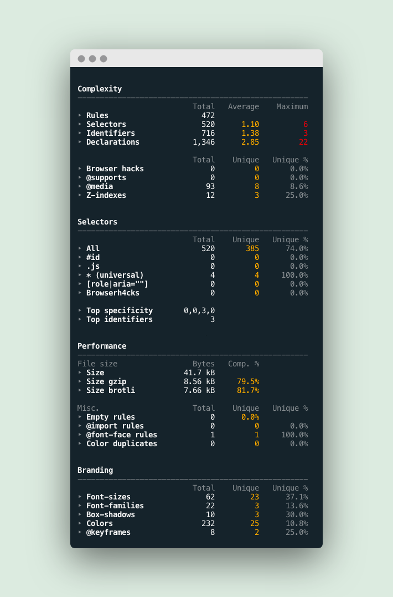

<div align="center">
  <h1>Wallace CLI</h1>
  <p>Pretty CSS analytics in your terminal.</p>
</div>

[](https://www.npmjs.com/package/wallace-cli)

## Installation

```sh
npm install wallace-cli
```

## Usage

```sh
Usage
  $ wallace <path-to-file>

Options
  --json Format as JSON instead of a table
  --help, -h Show this help

Examples
  # Point to a file
  $ wallace path/to/styles.css

  # CSS via stdin
  $ cat style.css | wallace

  # CSS from a server
  $ curl http://localhost/css/style.css | wallace

  # Format as json
  $ wallace path/to/styles.css --json
```

## Example output



## Related projects

- [CSS Diff Action](https://github.com/projectwallace/css-diff-action) - A GitHub
  Action that comments on your PR with the changes in your CSS stats.
- [CSS Analyzer](https://github.com/projectwallace/css-analyzer) - The analyzer that powers this module
- [Constyble](https://github.com/projectwallace/constyble) - A CSS complexity
  linter, based on css-analyzer. Don't let your CSS grow beyond the thresholds that you provide.
